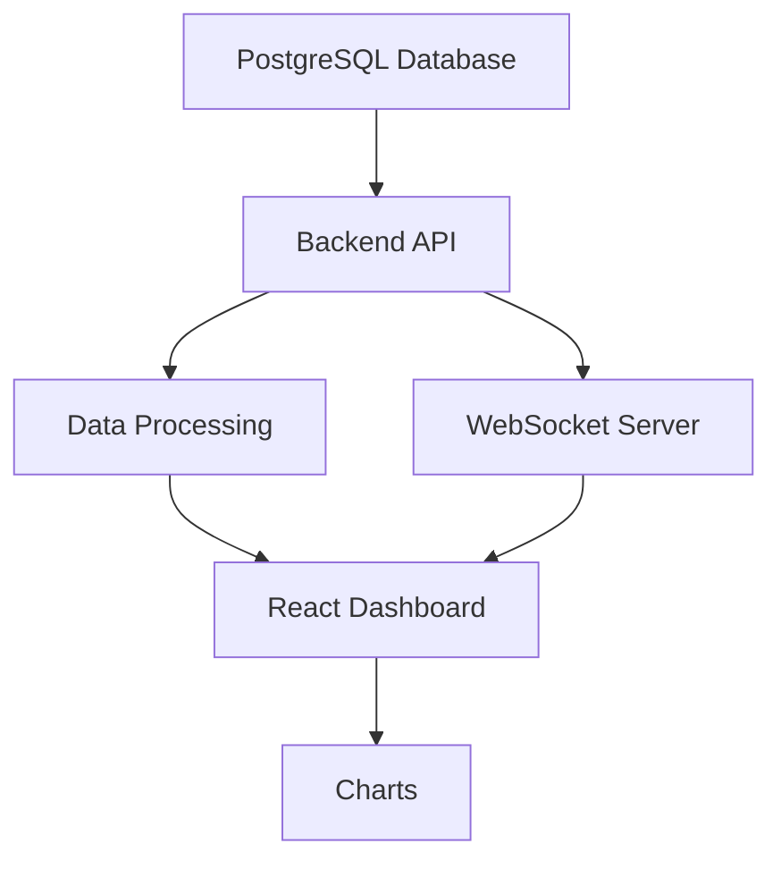

# 📊 Transcendence Data Analytics  
> Advanced Data & Analytics Module for 42 ft_transcendence


---

## 📖 Overview

This repository contains the **Data & Analytics module** of the **42 ft_transcendence project**, designed to transform raw gameplay data into **real-time, interactive dashboards**.

The entire system is fully **containerized with Docker**, integrating:
- PostgreSQL (database)
- Backend API
- React frontend
- WebSocket real-time updates

---

## 🧠 Features

- 📊 Interactive charts (Pie, Bar, Line)
- ⚡ Real-time updates via WebSockets
- 📁 Data export (CSV / JSON)
- 📅 Custom date filtering
- 📈 Player performance tracking
- 🧮 Aggregated statistics (wins, losses, ratios)

---

## 🏗️ Architecture



---

## ⚙️ Tech Stack

### 🔹 Frontend
- React  
- TypeScript  
- Chart.js  

### 🔹 Backend
- REST API  
- WebSockets  

### 🔹 Database
- PostgreSQL  

### 🔹 DevOps
- Docker  
- Docker Compose  

---

## 📂 Project Structure

```
.
├── docker-compose.yml
├── .env
├── frontend/
│   └── Dockerfile
├── backend/
│   └── Dockerfile
└── ...
```

---

## 🚀 Setup & Usage (Docker Only)

### 🔧 1. Clone the repository
```bash
git clone https://github.com/your-username/Data-Analysits-for-trancendance.git
cd Data-Analysits-for-trancendance
```

### ⚙️ 2. Configure environment variables
```env
POSTGRES_DB=transcendence
POSTGRES_USER=postgres
POSTGRES_PASSWORD=secure_password
API_URL=http://backend:5000
```

---

### 🐳 3. Build & Run Everything
```bash
docker compose up --build
```

👉 This will:
- Build frontend & backend images (including npm install internally)
- Start PostgreSQL
- Launch API + WebSocket server
- Serve the React dashboard

---

### 🛑 Stop Containers
```bash
docker compose down
```

---

## 🧩 System Design

- 🐳 Each service runs in its own container  
- 🔗 Services communicate via Docker network  
- 📦 Dependencies installed inside Dockerfiles  
- 🔄 Fully reproducible environment  

---

## 🔒 Key Concepts

- Full data pipeline (DB → API → Frontend)  
- SQL aggregation & analytics queries  
- Real-time systems (WebSockets)  
- Containerized development  
- Frontend performance & visualization  

---

## ⚠️ Challenges

- Designing efficient PostgreSQL queries  
- Syncing real-time and API data  
- Managing multi-container architecture  
- Handling large datasets smoothly  
- Keeping UI responsive  

---

## 🏁 Conclusion

This project demonstrates a **production-like data analytics system**, combining:

👉 PostgreSQL + Backend API + WebSockets + React Dashboard  

All orchestrated with Docker for a clean and reproducible setup.

---

## 👤 Author

**p.Prime**  
42 Network Student (1337)

---

## ⭐ Final Note

This project reflects real-world skills in:
- Data Engineering  
- Full-Stack Development  
- DevOps & Containerization  
- Real-Time Analytics Systems  
